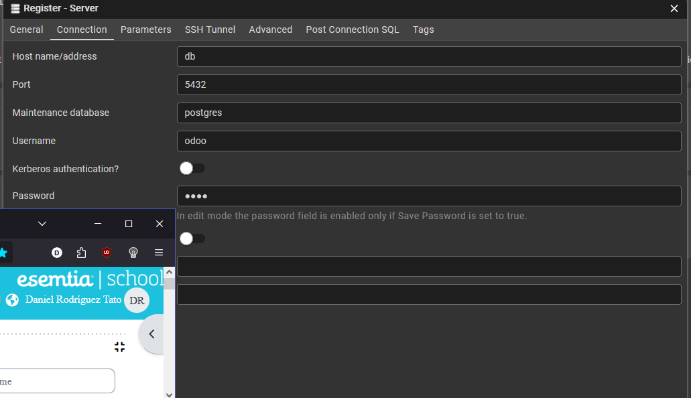
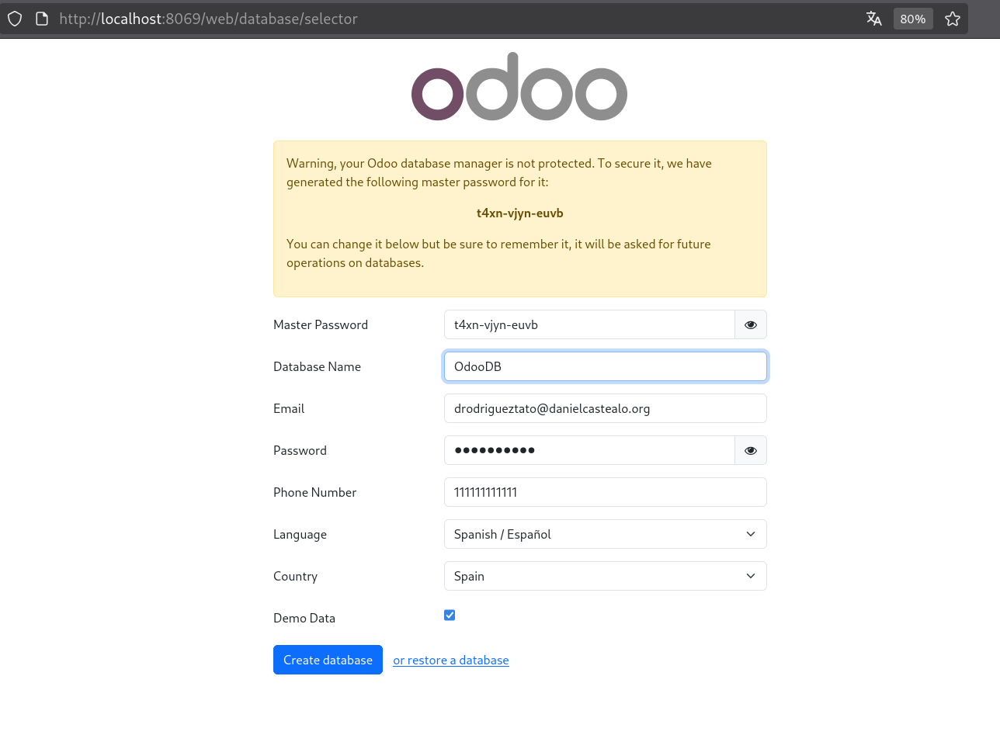
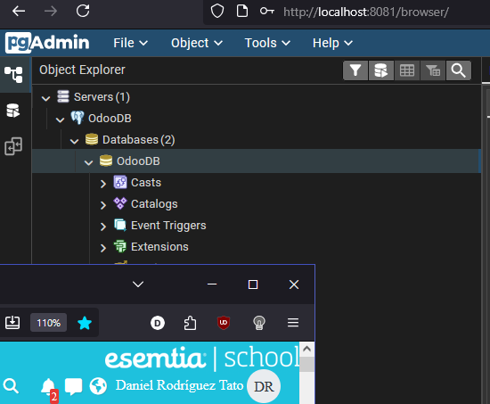
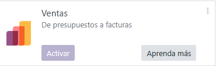
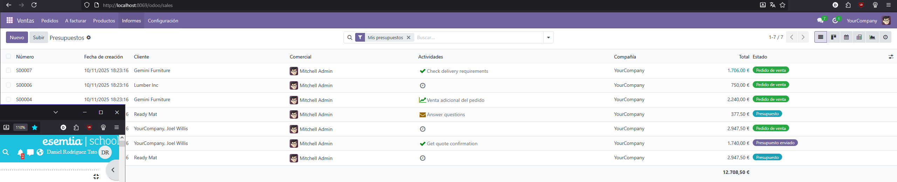

# Tarea 18 Odoo + PostgreSQL + PgAdmin

Guía paso a paso para levantar un entorno de desarrollo con Odoo 18 Community, PostgreSQL 16 y PgAdmin4 usando Docker Compose.

---

## Extensiones instaladas:

| Plugin | Utilidad                                  |
| --- |-------------------------------------------|
| Docker | Permite gestionar contenedores, imágenes desde el IDE|
| .env Files | Resalta la sintaxis y permite manejar variables de entorno fácilmente|

## `docker-compose.yml`

```yaml
services:

  odoo:
    image: odoo:18
    container_name: odoo
    ports:
      - "8069:8069"
    depends_on:
      - db
    environment:
      - HOST=db
      - USER=odoo
      - PASSWORD=odoo
    volumes:
      -odoo_data:/var/lib/odoo

  db:
    image: postgres:16
    container_name: odoo_db
    environment:
      - POSTGRESUSER=odoo
      - POSTGRESPASSWORD=odoo
      - POSTGYRES_DB=postgres
    volumes:
      - db_data:/var/lib/postgresql/data

  pgadmin:
    image: dpage/pgadmin4:latest
    restart: unless-stopped
    depends_on:
      - db
    environment:
      - PGADMIN_DEFAULT_EMAIL=drodrigueztato@danielcastealo.org
      - PGADMIN_DEFAULT_PASSWORD=Vboxuser1.
    ports:
      - "8081:80"

volumes:
  odoo_data:
  db_data:
```

## Levantar los servicios
Desde la carpeta donde se encuentre el archivo `docker-compose.yml` ejecutar:

```bash
docker compose up -d
```

Accesos:
- Odoo: http://localhost:8069

- PgAdmin: http://localhost:8081

---

## Conectar a PgAdmin

Abrir http://localhost:8081 y loguearse con el correo y la contraseña definidos en las variables de entorno.
Crear una nueva conexión con los siguientes datos:


# Configuración inicial de Odoo

Abrir Odoo en http://localhost:8069.
Crear una nueva base de datos con los siguientes datos:


---

En PgAdmin se podrá comprobar que la base de datos ya aparece.


---

## Instalación de un módulo:
Para instalar el módulo de Ventas, simplemente haz clic en “Activar” y espera unos minutos hasta que finalice la instalación.


Así se ve Odoo una vez instalado el módulo:


